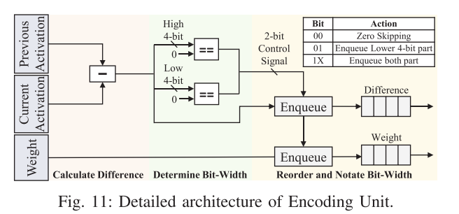
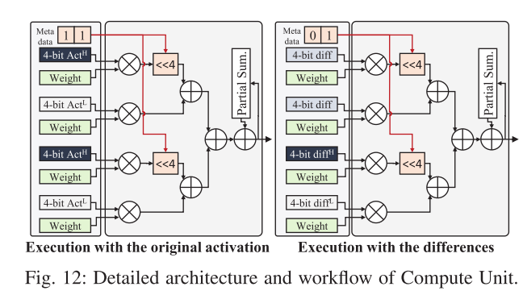

# Ditto Accelerating Diffusion Model via Temporal Value Similarity 的复现
针对fig11 和 fig12  
语言: Verilog  

项目结构:  
```tree
├── .gitignore
├── check.py  // 验证脚本, 通过run.sh --check调用
├── run.sh    // 测试脚本, 运行仿真和验证
├── RTL
│   ├── compute_unit.v   // 计算模块
│   ├── control_unit.v   // 控制模块
│   ├── ditto_top.v      // 顶层模块
│   ├── encoding_unit.v  // 编码模块
│   ├── mini_cache.v     // 存放数据的简单cache
│   └── testbench
│       ├── data
│       │   ├── data_now_mem.hex  // 存放现激活数据
│       │   ├── data_pst_mem.hex  // 存放前激活数据
│       │   └── weight_mem.hex    // 存放权重数据
│       └── ditto_tb.v            // testbench
└── README.md
```


## Encoding Unit:
按照论文描述实现, 这里讲一讲论文没有提到的一些问题
  

### 入队逻辑
针对入队逻辑, 文章并没有细讲, 这里提出一个相对比较简单的算法:  
定义: 低4位叫 `l4`, 高4位叫 `h4`; `0000`表示队列状态, `1`表示放数的位置.  
- 前提: 所有溢出的数据一定是 `l4`
- 如果入队数据只有 `l4`, 那么 `l4` 按照从低往高的顺序存放 (比如`0001` -> `0011`)
- 如果入队数据是 `l4` 和 `h4`, 那么按以下情况处理:
	- `0000`: `l4->0001`, `h4->0010`, 结果`0011`
	- `0001`: `l4->0100`, `h4->0010`, 结果`0111`
	- `0011`: `l4->0100`, `h4->1000`, 结果`1111`
	- `0111`: `l4->buf` , `h4->1000`, 结果`1111`, `buf_valid=1`
- `buf_valid=1`: 在队列传递给下一级后, `buf->0001`
- 可以观察到, 这样的排列方式下, 队列永远是从低往高放数据, 并且溢出的只有 `l4`, 所以这样覆盖了全部情况.


### control signal的不同
相比论文图片, 具体的代码实现还需要考虑到差分结果是有符号数, 所以实际上 `h4` 不能直接和`0`比较, 而是要跟`符号位`比较, 为了便于后面的有符号乘法, 这里选择这么处理:  
```verilog
control_signal[1] <= (data_diff[7:4] != {4{data_diff[3]}});
control_signal[0] <= (data_diff[3:0] != 4'b0);
```
这样如果差分结果取`4bit`, 输入队列的数据可以直接进行有符号乘法得到结果.  


### 进位补偿
如果考虑到了有符号数, 那么`8bit`数不能简单拆成两个`4bit`直接用乘法和移位计算结果, 还需要考虑进位补偿  
比如: `8'b00001111`, 拆成 `4'b0000` 和 `4'b1111` 之后低4位就变成负数了, 显然直接计算是会出问题的  

进位补偿: `Value = 16 * H_signed + L_signed + 16 * b_3`  
可以看到,  进位补偿的条件: 差分结果是 `8bit && b_3.` 在代码实现中, 我们将这两个条件分散到 `Encoding Unit` 和 `Compute Unit` 两个模块  

#### 具体实现
在 `Encoding Unit` 中, 我们模仿 `meta_data` 新增 `carry_comps` 信号, 代表这个数据是否需要进位补偿.  
根据入队逻辑, 我们可以发现当差分结果为`8bit`时, `l4` 一定只会放在第一个或第三个位置.  
因此定义 `carry_comps` 为两位独热码, 代表队列中第一个和第三个数据是否需要进位补偿.  

在 `Compute Unit` 中, 定义补偿数据, 加到原本的计算结果中  
```verilog
assign comp_data = (((carry_comps[0] & mul_src1[3]) ? weight1 : 0)
                  + ((carry_comps[1] & mul_src3[3]) ? weight3 : 0)) << 4;
```


## Compute Unit
除了进位补偿没有新的东西, 对于 `Partial Sum`, 这里简化为矩阵计算中的一次运算结果(一行乘一列).  
  


## 运行测试
初步测试激活数据顺序(差分之后的bit):  
`0 // 4, 4, 4, 4 // 8, 8 // 4, 4, 8 // 4, 8, 4 // 8, 4, 8`  

运行仿真并生成相关文件:  
```sh
./run.sh
```

对运行结果进行验证(针对队列内容, 单次计算结果, 总结果):  
```sh
./run.sh --check
```

